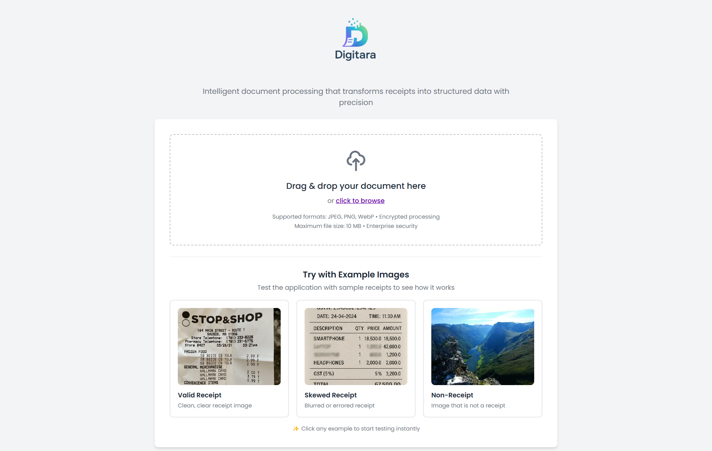
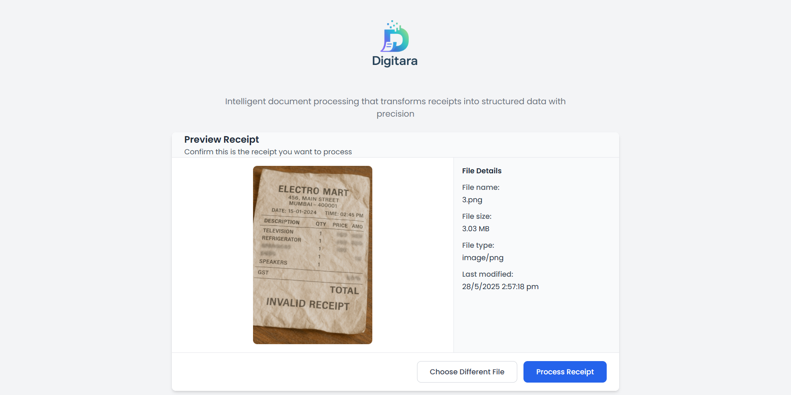
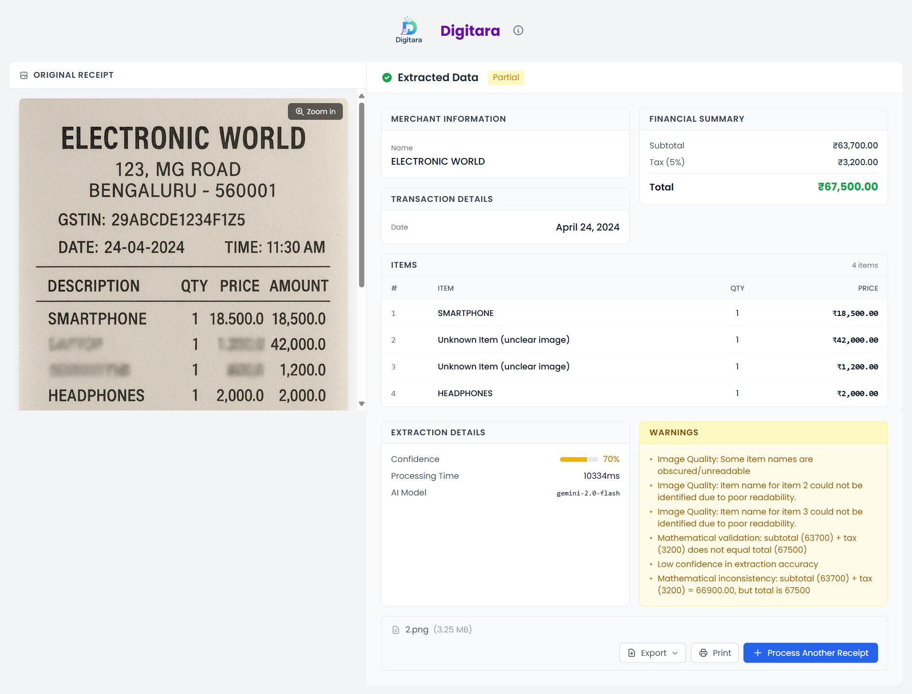

#  Receipt Extractor Frontend

> 🚀 **AI-Powered Receipt Processing Web Application** - Transform receipt images into structured data instantly with an intuitive, modern interface.

<div align="center">
  
  
  [](https://reactjs.org/)
  [](https://www.typescriptlang.org/)
  [](https://vitejs.dev/)
  [](https://tailwindcss.com/)

</div>


## 📋 Table of Contents

- [Overview](#-overview)
- [Features](#-features)
- [Technology Stack](#-technology-stack)
- [Getting Started](#-getting-started)
- [Project Structure](#-project-structure)
- [Application Flow](#-application-flow)
- [Components Overview](#-components-overview)
- [Configuration](#-configuration)
- [Development](#-development)
- [Troubleshooting](#-troubleshooting)


---

## 🎯 Overview

The **Receipt Extractor Frontend** is a modern, responsive web application that provides an intuitive interface for uploading receipt images and extracting structured data using AI technology. Built with React, TypeScript, and Tailwind CSS, it offers a seamless user experience with real-time processing feedback, comprehensive error handling, and multiple export options.

### 🎨 Key Highlights

- **🖱️ Drag & Drop Upload** - Intuitive file upload with visual feedback
- **👁️ Real-time Preview** - View your receipt before processing
- **📊 Progress Tracking** - Visual indicators for each processing stage
- **📱 Fully Responsive** - Optimized for desktop, tablet, and mobile devices
- **🌐 Offline Detection** - Smart network status monitoring
- **💾 Session Persistence** - Results saved across page refreshes
- **🖨️ Export & Print** - Multiple export formats and print-friendly layouts

---

## ✨ Features

### 🚀 Core Features

#### 1. **Smart File Upload**
- Drag and drop support with visual feedback
- Click to browse file selection
- File type validation (JPEG, PNG, WebP)
- File size validation (max 10MB)
- Real-time error feedback

#### 2. **Image Preview**
- Full-resolution image preview before processing
- Zoom functionality for detailed inspection
- File metadata display (name, size, type, modified date)
- Cancel and re-select options

#### 3. **AI-Powered Extraction**
- Real-time processing with 4-stage progress tracking:
  - 📤 Uploading (0-30%)
  - ⚙️ Processing (30-60%)
  - 🤖 Extracting (60-90%)
  - ✅ Finalizing (90-100%)
- Visual progress indicators and status messages
- Smooth animations and transitions

#### 4. **Comprehensive Results Display**
- **Structured Data Presentation**:
  - Merchant information
  - Transaction details (date, receipt number, payment method)
  - Itemized list with quantities and prices
  - Financial summary (subtotal, tax, total)
- **Confidence Scoring**: Visual indicators for extraction accuracy
- **Multi-currency Support**: Automatic currency detection and formatting
- **Responsive Layout**: Adaptive design for all screen sizes

#### 5. **Export & Sharing Options**
- **JSON Export**: Structured data for integration
- **Text Export**: Formatted plain text receipt
- **Print Support**: Print-friendly layout with optimized styling
- **Session Storage**: Automatic saving of results

### 🛡️ Advanced Features

#### 6. **Error Handling & Recovery**
- Specific error messages for different scenarios:
  - Not a receipt detection
  - No items found
  - Network errors
  - File validation errors
  - Server errors
- Retry mechanism with attempt counting
- Helpful tips for successful extraction

#### 7. **Network Intelligence**
- Real-time online/offline detection
- Slow connection warnings
- Automatic API health checks
- Connection recovery handling

#### 8. **Performance Optimizations**
- Lazy loading of components
- Image optimization before upload
- Efficient state management
- Memory leak prevention
- Session-based caching

#### 9. **Accessibility Features**
- ARIA labels for screen readers
- Keyboard navigation support
- High contrast mode support
- Focus management

---

## 🖼️ Screenshots

<div align="center">
  
  <p><em>Drag & Drop Upload Interface</em></p>
</div>

<div align="center">
  
  <p><em>Image Preview Screen with File Details</em></p>
</div>

<div align="center">
  
  <p><em>Real-time Processing Progress</em></p>
</div>

<div align="center">
  
  <p><em>Extracted Receipt Data Display</em></p>
</div>

<div align="center">
  
  <p><em>Results with Low Confidence Warnings</em></p>
</div>

---

## 🛠️ Technology Stack

### Core Technologies
- **[React 19](https://react.dev/)** - Modern UI library with latest features
- **[TypeScript 5.7](https://www.typescriptlang.org/)** - Type-safe development
- **[Vite 6.3](https://vitejs.dev/)** - Lightning-fast build tool
- **[Tailwind CSS 3.4](https://tailwindcss.com/)** - Utility-first CSS framework

### Key Libraries
- **[Axios](https://axios-http.com/)** - HTTP client with interceptors
- **[React Dropzone](https://react-dropzone.js.org/)** - Drag & drop file uploads
- **[React DOM](https://react.dev/)** - DOM rendering and portal support

### Development Tools
- **ESLint** - Code quality and consistency
- **PostCSS** - CSS processing
- **Autoprefixer** - Browser compatibility

---

## 🚀 Getting Started

### Quick Start

```bash
# 1. Clone and enter the directory
git clone <repository-url>
cd receipt-extractor-frontend-ai-engineer-Rkcr7

# 2. Install dependencies
npm install

# 3. Start development server
npm run dev

# 4. Open http://localhost:5173 in your browser
```

### Prerequisites

- **Node.js**: v18.20.4 or higher (use `.nvmrc` for exact version)
- **npm**: v10+ or equivalent package manager
- **Backend API**: The receipt extraction backend must be running (default: `http://localhost:3000`)

> ⚠️ **Important**: This frontend application requires the Receipt Extractor Backend to be running. Please ensure you have set up and started the backend service before running the frontend.

### Installation

1. **Clone the repository**
   ```bash
   git clone <repository-url>
   cd receipt-extractor-frontend-ai-engineer-Rkcr7
   ```

2. **Set Node version** (recommended)
   ```bash
   nvm install && nvm use
   # or manually set to Node v18+
   ```

3. **Install dependencies**
   ```bash
   npm install
   ```

4. **Configure environment** (optional)
   ```bash
   # Create .env file for custom API URL
   echo "VITE_API_BASE_URL=http://localhost:3000" > .env
   ```

5. **Start development server**
   ```bash
   npm run dev
   ```

6. **Open in browser**
   ```
   http://localhost:5173/
   ```

### Testing with Sample Receipts

The repository includes sample receipt images in the `sample-receipts/` directory for testing:
These samples demonstrate various receipt formats, currencies, and languages that the system can process.

---

## 📁 Project Structure

```
receipt-extractor-frontend/
├── public/                    # Static assets
│   ├── favicon.ico           # Application favicon
│   └── logo.png              # Application logo
├── src/                      # Source code
│   ├── components/           # React components
│   │   ├── AppHeader/        # Application header with branding
│   │   ├── FileUpload/       # Drag & drop upload component
│   │   ├── FilePreview/      # Image preview before processing
│   │   ├── ExtractionProgress/ # Processing progress indicator
│   │   ├── ExtractionResults/  # Results display components
│   │   └── Print/            # Print-specific components
│   ├── config/               # Configuration files
│   │   └── ui-settings.ts    # UI customization settings
│   ├── services/             # API and external services
│   │   └── api.service.ts    # Backend API integration
│   ├── types/                # TypeScript type definitions
│   │   └── receipt.types.ts  # Receipt data interfaces
│   ├── utils/                # Utility functions
│   │   ├── export.utils.ts   # Export functionality
│   │   ├── file.utils.ts     # File handling utilities
│   │   ├── network.utils.ts  # Network monitoring
│   │   └── print.utils.ts    # Print functionality
│   ├── App.tsx               # Main application component
│   ├── main.tsx              # Application entry point
│   └── index.css             # Global styles (Tailwind)
├── .nvmrc                    # Node version specification
├── package.json              # Dependencies and scripts
├── tailwind.config.js        # Tailwind CSS configuration
├── vite.config.ts            # Vite build configuration
└── tsconfig.json             # TypeScript configuration
```

---

## 🔄 Application Flow

### User Journey


### Processing Stages

1. **Uploading (0-30%)** - Securely uploading receipt image
2. **Processing (30-60%)** - Optimizing image for AI extraction
3. **Extracting (60-90%)** - AI analyzing and extracting data
4. **Finalizing (90-100%)** - Preparing and validating results

---

## 🧩 Components Overview

### Core Components

#### 1. **App.tsx**
- Main application orchestrator
- State management for entire flow
- Network monitoring
- Session persistence

#### 2. **FileUpload**
- Drag & drop implementation
- File validation
- Visual feedback
- Accessibility support

#### 3. **FilePreview**
- Image rendering
- Metadata display
- Zoom functionality
- Action buttons

#### 4. **ExtractionProgress**
- Multi-stage progress tracking
- Animated indicators
- Status messages
- Step visualization

#### 5. **ExtractionResults**
- Responsive layout (desktop/mobile)
- Data sections organization
- Export functionality
- Print support

### Supporting Components

- **AppHeader**: Branding and information
- **DataSections**: Structured data display
- **ReceiptImageViewer**: Image viewing with zoom
- **MetadataAndActions**: Extraction details and actions
- **ExportDropdown**: Export format selection
- **PrintableReceipt**: Print-optimized layout

---

## ⚙️ Configuration

### UI Customization

The application UI can be customized via `src/config/ui-settings.ts`:

```typescript
export const UI_SETTINGS = {
  itemsTable: {
    maxVisibleItems: 5,      // Items before scroll
    rowHeight: 48,           // Pixel height per row
    showRowNumbers: true,    // Display row numbers
    enableHoverEffects: true, // Row hover effects
    compactMode: false       // Compact display mode
  },
  layout: {
    imagePanelWidth: 35,     // Image panel width %
  },
  animations: {
    enableTransitions: true,  // Smooth transitions
    transitionDuration: 200   // Animation duration (ms)
  },
  confidence: {
    highThreshold: 0.8,      // Green indicator
    mediumThreshold: 0.6,    // Yellow indicator
    showProgressBar: true    // Visual confidence bar
  }
}
```

### API Configuration

Set custom API endpoint via environment variable:

```bash
# .env file
VITE_API_BASE_URL=https://your-api-endpoint.com
```

---

## 🔌 API Integration

The frontend communicates with the backend through a well-structured API service layer:

### API Service (`src/services/api.service.ts`)

**Key Features:**
- Axios-based HTTP client with interceptors
- Automatic error handling and transformation
- Request/response logging in development
- Network error detection
- Type-safe API methods

**Available Methods:**
```typescript
// Extract receipt from image
extractReceipt(file: File, options?: ExtractReceiptRequest): Promise<ReceiptResponse>

// Check API health
checkHealth(): Promise<HealthCheckResponse>

// Get supported currencies
getSupportedCurrencies(): Promise<SupportedCurrency[]>

// Validate receipt data
validateReceipt(receiptData: ReceiptResponse): Promise<ValidationResult>
```

**Error Handling:**
The API service provides detailed error information with specific error codes:
- `NOT_A_RECEIPT` - Image is not a valid receipt
- `NO_ITEMS_FOUND` - No items could be extracted
- `NETWORK_ERROR` - Connection issues
- `AI_SERVICE_UNAVAILABLE` - AI processing unavailable
- `FILE_TOO_LARGE` - File exceeds size limit
- `EXTRACTION_FAILED` - General extraction failure

---

## 💻 Development

### Available Scripts

```bash
# Start development server
npm run dev

# Build for production
npm run build

# Preview production build
npm run preview

# Run linter
npm run lint
```


---

## 🔧 Troubleshooting

### Common Issues

#### 1. **"Failed to connect to backend API"**
- **Cause**: Backend not running or wrong URL
- **Solution**: 
  - Start backend server
  - Check `VITE_API_BASE_URL` in `.env`
  - Verify CORS settings in backend

#### 2. **"File type not supported"**
- **Cause**: Unsupported file format
- **Solution**: Use JPEG, PNG, or WebP images only

#### 3. **"Network error" during processing**
- **Cause**: Connection issues or timeout
- **Solution**:
  - Check internet connection
  - Verify backend is accessible
  - Try reducing image size

#### 4. **Slow performance**
- **Cause**: Large images or slow network
- **Solution**:
  - Compress images before upload
  - Check network speed indicator
  - Use production build for better performance

